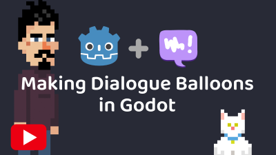

# Godot Dialogue Manager Example Balloons

Here are some example balloons that you can use as a starting point when using the [Godot Dialogue Manager](https://github.com/nathanhoad/godot_dialogue_manager).

Examples include:

- A pixel balloon for low res games (with talking beeps)
- A balloon featuring character portraits
- A point n click adventure style dialogue system (with voice)

## Explainer video

## License

Licensed under the MIT license, see `LICENSE` for more information.
